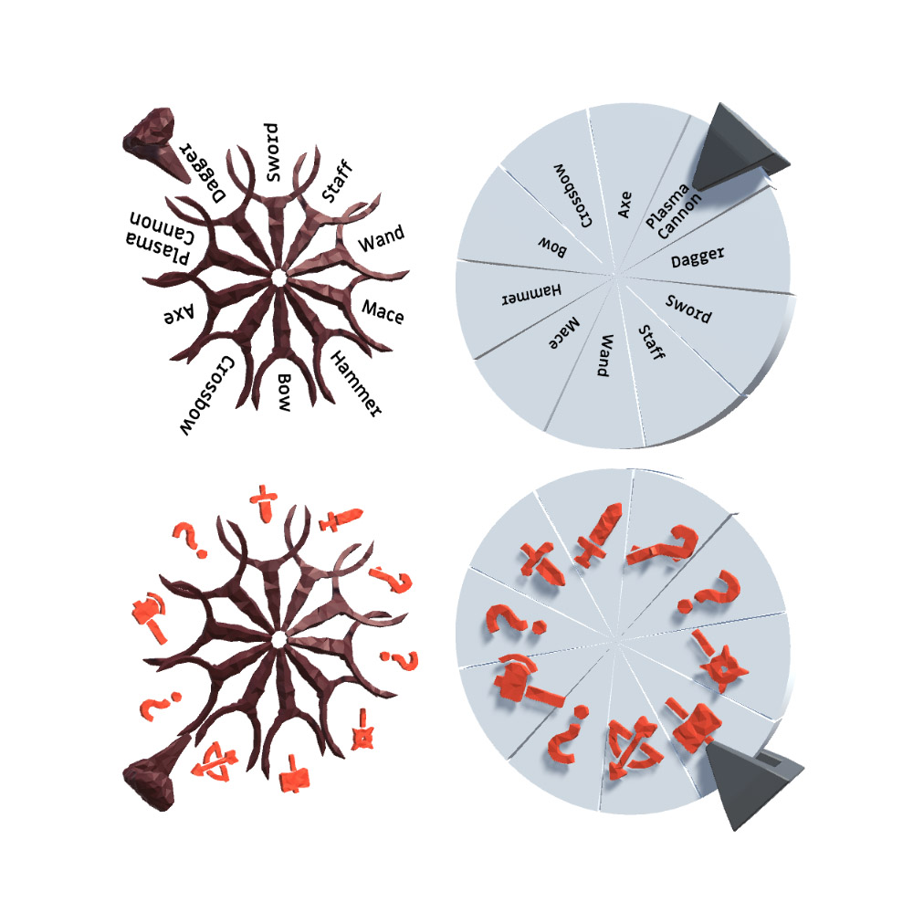

# The Wheel of Pseudo Fortune
The Wheel of Pseudo Fortune, or just the wheel, is a Unity asset that helps you create a wheel of fortune - either in the UI or in world space.

The Wheel is constructed in a way that each slot is a subwheel, so you can string rolls (e.g. first roll for a category, then an item, then a rarity level) and create nested probabilities.

The Wheel provides a callback for the Roll event, to which you can register your own custom functionality. In addition, the example renderers I'll keep adding to this package all inherit the same renderer class, making it highly customizable.

## How to use

```csharp
Wheel wheel = Wheel.Create();
```
Creates a new wheel.

```csharp
wheel.AddSlot(Wheel.Create(chance: 1, name: "epic_sword"));
wheel.AddSlot(Wheel.Create(chance: 3, name: "rare_sword"));
wheel.AddSlot(Wheel.Create(chance: 6, name: "common_sword"));
```
Adds three slots into the wheel.

```csharp
Wheel filler = Wheel.Create(chance: 20, name: "filler");
filler.AddSlot(Wheel.Create(name: "piece_of_rope"));
filler.AddSlot(Wheel.Create(name: "clothespin"));
filler.AddSlot(Wheel.Create(name: "sock_with_missing_pair"));

wheel.AddSlot(filler);
```
Creates a new wheel with its own child slots and add this to the main wheel. This will make the original wheel nested, and it will roll for a
1/30 chance of epic sword<br />
3/30 chance of rare sword<br />
6/30 chance of common sword<br />
20/30 chance of filler materials, where:<br />
-1/3 chance of piece of rope<br />
-1/3 chance of clothespin<br />
-1/3 chance of sock with a missing pair<br />

Once you are happy with the contents of your wheel, you can roll it, like this:
```csharp
RollResult result = wheel.Roll();
```
Result will contain the selected slot, including the consecutive results if it is a nested wheel.

## Renderers
The wheel does not need a renderer to work (see nogui demos). But if you like, you can subscribe arbitrary number of views to it. When finished the project will have four distinctly different renderers to display some diverse ways to render the wheel; Namely the Disk, Grid, Roller and Console 86 (a.k.a. the Brundle Console)

Right now, there are the Disk and the Console 86 renderers are included in this commit.

### How to bind renderers
Each renderer is composed of a wheel renderer, and an associated unit renderer. Units are the representations of the slots, and the wheel renderer is, well, the representation of the wheel itself. Every renderer derives from WheelRenderer, and each unit derives from UnitRenderer.

Each WheelRenderer has the SetWheel function, which internally subscribes it to the wheel.
```csharp
foreach (WheelRenderer renderer in wheelRenderers)
    if (renderer) renderer.SetWheel(wheel);
```
As an example, if you have an array of renderers, the code above will set each valid renderer's wheel as the given wheel, and everytime the wheel is Rolled, they will automatically be notified.

Here are 4 disk renderers, listening to the same wheel. Two of them have generated meshes, while the other two have imported, fixed meshes. In each pair, one uses text content, while the other uses the non-text, generic content that is defined in the unit renderer associated with the wheel renderer. Namely a sprite and a game object in this example.


#### Final note
This is an ongoing project and new renderers will be added soon.